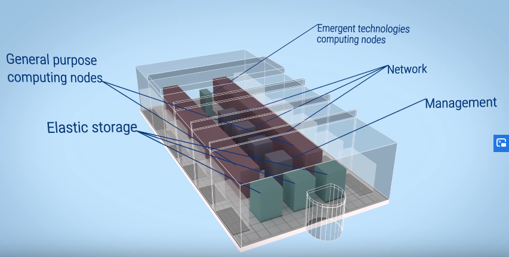

# Ejercicio Centros de Datos

## Ejemplos de centros de datos reales

### Índice

1. **CPD del Port d’Informació Científica (PIC). RedIris**
2. **Supercomputador "Marenostrum" del Barcelona Supercomputing Center**
3. **Supercomputador "Fugaku" de Fujitsu, en Japón**

### 1. CPD del Port d’Informació Científica (PIC). RedIris

El PIC es un Centro de datos científico, ubicado en Barcelona y perteneciente a la red RedIris, con una infraestructura diseñada para recibir, almacenar, analizar y procesar datos científicos. 

Forma parte del *Worldwide LHD computing grid* del LHC, el cual cuenta con certificación TIER-1, realizando un 5% del procesamiento de los datos del mismo, para los detectores de ATLAS, CMS y LHCb.

También da soporte a otros proyectos de astrofísica y cosmología: T2K, MAGIC, CTA, PAU y EUCLID

#### Hardware

Cuenta con unos 6000 núcleos de procesamiento (~77 kHSS06), 7 PB de datos en disco, y 18 PB en cintas magnéticas.

#### Conectividad

Cuenta con una conexión WAN de 20 Gbps, que une el CPD a la Anella Cientifica.
RedIris actúa como ISP, conectando en el nivel 2 con la LHC1 y la LHCOPN, redes dedicadas al proyecto del LHC.

- **LHCOPN:** para transferencias con TIER1-CERN (10 Gbps)
- **LHCONE:** transferencias de datos desde los centros TIER2 (CIEMAT, IFAE, IFIC, IFCA, UAM y USC) (10 Gbps)

#### Infraestructura de procesamiento

##### Equipos hardware

- **Almacenamiento**
	- **Fabricantes:** Supermicro, Flytech, Intel
- **Procesamiento:** HPBlades, Dell C6100, Intel S2600TP
	+ 9 chasis Intel S2600TP (36 servidores)
		* Procesadores Intel Xeon E5-2640v3 (2.60 GHz)
		* 64 GB RAM
		* Disco SSD 500 GB
- **Red:** 
	+ **Núcleo de red:** Cisco
	+ **Switches:** Dell, Cisco, HP
	+ **Firewalls**: Fortinet

##### Software

- **Almacenamiento:** dCache (disco) y Enstore (cinta). Sistema integrado disco-cinta
- **Gestores de colas:** PBS y HTCondor
- **Virtualización:** oVirt y RHEV
- **Monitorización:** Icinga, Thruk, Centreon, Kibana, Ganglia y Cacti
- **Big Data**: Hadoop
- **Instalación y configuración de sistemas:** Puppet
- **Infraestructura Cloud:** OpenNebula
- **Sistemas de ficheros:** XFS, CFS
- **Sistemas operativos:** CentOS y RedHat
- **Inventario:** OpenDCIM

#### Infraestructura del CPD

El PIC cuenta con dos Centros de Procesamiento de Datos: uno principal, compartido con la Universidad Autónoma de Barcelona; y otro secundario, dedicado a procesamiento de alta densidad.

##### CPD Principal

- **Superficie:** 150 m^2 , compartido con la Universidad Autónoma de Barcelona (sala completa, 400 m^2)
-  Sistema de refrigeración FreeCooling con soporte adiabático instalado en 2014

- **Potencia IT:**
	+ 130 kW en CPD de PIC
	+ ~150 kW en CPD de UAB

##### CPD Alta Densidad

- Espacio confinado de 25 m^2 ubicado en un almacén
- Sistema de refrigeración por inmersión en líquido de los equipos IT
- PUE actual: ~1,3

#### Refrigeración

##### CPD Principal: FreeCooling

- **Estructura de refrigeración integrada en el edificio**

	El edificio cuenta con chimeneas para expulsar el aire caliente, como parte de la infraestructura para FreeCooling

	

- **Pasillos calientes confinados (parte común fría)**
	- Plenum para la conducción del aire caliente
	- Incluyen cortinas para confinar el aire caliente. 

	
	
- **Temperatura de inmersión:** 20 C
- **Temperatura de retorno:** 36 C
- **PUE 1.45**
	
##### CPD Alta Densidad: Refrigeración por inmersión

- **Infraestructura auxiliar:**
	+ Agua circulante a flujo constante en el intercambiador
	+ 3 aerorefrigeradores de 90 kW  
	
  
  
- **Sala:**
	+ Sala de 25 m^2
		- 4 tanques
		- 2 módulos de intercambio y bombeo
		- Densidad max. por tanque: 45 kW
		

*Equipos sumergidos dentro del tanque*

#### Monitorización y operación

- **Integrado bajo Centreon/Thruk/Panorama**
	+ **Datos del sistema de refrigeración**
		* **Sistema de control para dos tanques + intercambiador + bomba:** controlan temperaturas del aceite de los tanques, funcionamiento del intercambiador y la presión de la bomba  
		
	+ **Datos de la infraestructura**
		* **Cuadro de control de la hidráulica**, con información sobre la temperatura de los aerorefrigeradores, temperatura interior de la sala, la presión del agua... etc
		* **Salida BACnet sobre TCP/IP**  
		
	+ **Datos de los servidores**
		* Mediante consultas a IPMI, por cada servidor:
			- Temperaturas
			- Potencia consumida

La monitorización está integrada en Centreon, con los datos centralizados en un Thruk, que permite visualizarlo gráficamente a través de Panorama.

Podemos ver un ejemplo de la interfaz en esta imagen:

*Interfaz de Monitorización*

La herramienta de monitorización también cuenta con un histórico, que permite analizar los datos a lo largo del tiempo, y representarlos de forma gráfica.

### 2. Supercomputador "Marenostrum" del Barcelona SuperComputing Center

El Marenostrum es el supercomputador mas potente de España, y bastante emblemático. Ubicado en Barcelona, se construyó en 2004, y desde entonces ha sufrido varias actualizaciones, siendo la última la versión 4, construida en Julio de 2017.

#### Capacidad de cálculo

Su capacidad de cálculo está repartida en dos bloques diferenciados: el bloque de propósito general, y un bloque de tecnologías emergentes.

##### Bloque de propósito general

- **165888 procesadores, repartidos en 48 racks con 3456 nodos**
	- Cada nodo cuenta dos chips Intel Xeon Platinum, con 24 procesadores por chip a 2,1 GHz.
- **Memoria principal de 390 TB**
	+ 216 nodos con 12x32 GB DDR4-2667 DIMM (8 GB/core)
	+ 3240 nodos con 12x8 GB DDR4-2667 DIMM (2G/core)
- **Potencia de procesamiento de 11,5 PetaFLOPS**
- **Consumo de 1,3 MW/año**
- **Sistema operativo: SUSE Enterprise Server 12 SP2**

##### Bloque de tecnologías emergentes

Formado por varios clusters de 3 tecnologías diferentes

- **CTE-POWER**
	+ Formado por procesadores IBM Power 9 y GPUs NVIDIA Volta
	+ Potencia de cálculo superior a 1,5 PetaFLOPS. 
	+ Misma tecnología que los superordenadores Summit y Sierra
- **CTE Intel KNH**
	+ Formado por procesadores Intel Knight Hill
	+ Potencia de cálculo superior a 0,5 PetaFLOPS
	+ Mismos procesadores que los supercomputadores Theta y Aurora
- **CTE ARM**
	+ Compuesto por procesadores de 64 bit ARMv8	
	+ Potencia de cálculo superior a 0,5 PetaFLOPS
	+ Misma tecnología que el supercomputador PostK

#### Almacenamiento

- Capacidad de almacenamiento en disco: 14 PB
- Conectado a las infraestructuras Big Data del BSC-CNS
	- Capacidad total: 24,6 PB

#### Conectividad

- 100 Gbps Intel Omni-Path Full-Fat Tree
- 10 Gigabit Ethernet  

- Conectado a centros de investigación y universidades europeas a través de las redes RedIris y Geant

#### Infraestructura

##### Racks de Computo

- **48 racks destinados a cálculos. Cada rack incorpora:**
	+ 3.456 cores y 6912 GB de memoria
	+ Rendimiento pico: 226,80 TeraFLOPS
	+ Pico de consumo energético: 33,7 kW
- **Formados por equipos Lenovo SD530**
	+ 72 nodos de cómputo Lenovo Stark
	+ 2 Switches Lenovo G8272
	+ 3 Switches de frontera Intel OPA de 48 puertos
	+ 4 PDUs de 32 A
	
  
*Estructura de un rack de computo*

##### Nodos de Computo

##### Rack Intel Omni-Path

Los nodos de computo están conectados a través de una red Intel Omni-Path

- **Nodos conectados mediante cables de fibra óptica**
- **6 racks dedicados a elementos de la red**
- **Switches Intel Omni-Path Director Class**
	+ Hasta 768 puertos 100Gigabit Ethernet en 20U (20 unidades de rack) (+1U Shelf)
	+ 12 x PSUs (N+N) con capacidad de reemplazo en caliente (hot-swap)
	+ Módulos de ventilación con capacidad de reemplazo en caliente
	+ 2 módulos de administración
	+ 8 módulos con doble vía de comunicación (dual spine) tras el backplane (no bloqueante)
	+ 24 módulos de 32 puertos leaf (19 ocupados - 608 puertos)
	+ 2 ASICs por leaf
	+ Consumo energético de 9.4 kW

  
*Rack Intel Omni-Path*

##### Cluster CTE-Power

Cluster basado en **procesadores Power9**, con **sistema operativo GNU/Linux** y **red Infiniband**. Dispone de **4 GPUs por cada nodo**, haciéndolo un cluster ideal para aplicaciones aceleradas por GPU.

**Configuración:**

- **2 nodos de login y 52 nodos de cómputo, con las siguientes características:**
	+ **2 procesadores IBM Power9 8335-GTH @ 2.4GHz**
		* 3 GHz de turbo
		* 20 núcleos
		* 4 hilos por núcleo
		* Total: 160 hilos por nodo
	+ **512 GB de memoria principal**
		* 16 DIMMS x 32 GB
		* 2666 MHz por módulo
	+ **2 unidades SSD de 1.9 TB**
	+ **2 unidades NVME de 3.2 TB**
	+ **4 GPU NVIDIA V100 (Volta) con 16 GB HBM2**
	+ **Single port Mellanox EDR**
	+ **GPFS con un enlace de fibra 10 GBit**
- **Sistema Operativo: Red Hat Enterprise Linux 7.5 (Maipo)**

#### Imágenes

*Vista central del supercomputador: redes y cómputo*

*Vista posterior del supercomputador, con su infraestructura cableada bajo el suelo*

*Vista de uno de los nodos del supercomputador*

*Vista de los nodos de red del supercomputador*

*Distribución física de los equipos del supercomputador*

#### Vídeo explicativo

[Meet Marenostrum](https://www.youtube.com/watch?v=BV7gG95ejYs&feature=emb_logo)

### 3. Supercomputador Fugaku de Fujitsu

El supercomputador Fugaku es un computador basado en tecnología ARM, que recientemente ha conseguido el récord del supercomputador mas rápido del mundo.

Está construido por Fujitsu, y ubicado en Japón. Recientemente consiguió una puntuación de 415.23 PetaFLOPS en los benchmark de LINPACK, superando el anterior récord ostentado por el supercomputador Summit de IBM.

Fugaku también ha ganado en el ranking HPGC, dedicado a aplicaciones de supercomputadores en el mundo real.

#### Especificaciones

El supercomputador cuenta con un total de 158976 nodos.

##### Rendimiento

El rendimiento se reparte de la siguiente manera:

- **Modo normal (2.0 GHz)**
	+ Doble precisión (64 bits): 488 Petaflops
	+ Simple precisión (32 bits): 977 Petaflops
	+ Media precisión (16 bits): 1,95 Exaflops
	+ Entero (8 bits): 3,90 Exa Exa ops
- **Modo acelerado (2.2 GHz)**
	+ Doble precisión (64 bits):  537 Petaflops.
	+ Simple precisión (32 bits): 1,07 Exaflops
	+ Media precisión (16 bits): 2,15 Exaflops
	+ Entero (8 bits): 4,30 Exaops

- **Memoria: 4,85 PiB**
- **Ancho de banda de memoria: 163 PB/s**

##### Nodos

Cada nodo del supercomputador se compone de lo siguiente:

- Arquitectura: [ARMv8.2-A SVE 512 bits](https://github.com/fujitsu/A64FX)
	+ Con extensiones de Fujitsu: Hardware barrier, Sector cache, y Prefetch
- Número de núcleos de computación: 48
- Número de núcleos auxiliares:
	+ Nodo computacional: 2 núcleos
	+ E/S y nodo computacional: 4 núcleos
- Caché:
	+ L1D/núcleo: 64 KiB, 4 vías
		+ 256 GB/s (carga)
		+ 128 GB/s (almacenamiento)
	+ L2/CMG: 8 MiB, 16 vías
	+ L2/nodo: 4 TB/s (carga), 2 TB/s (almacenamiento)
	+ L2/núcleo: 128 GB/s (carga), 64 GB/s (almacenamiento)
- Memoria:
	+ HBM2 32 GB, 1024 GB/s
- Interconexión:
	+ PCIe Gen3 x 16
- Tecnología:
	+ 7nm FinFET

##### Almacenamiento

## Referencias

- [CPD del Port d’Informació Científica (PIC) con tecnologia de inmersión líquida - videoSesionTECNIRIS-53](https://www.rediris.es/tecniris/archie/vcTECNIRIS-53.html)
- [Marenostrum](https://www.bsc.es/es/marenostrum/marenostrum)
- [Marenostrum - Información Técnica](https://www.bsc.es/es/marenostrum/marenostrum/informacion-tecnica)
- [Japan's Arm-powered Fugaku named world's fastest supercomputer](https://www.datacenterdynamics.com/en/news/japans-arm-powered-fugaku-named-worlds-fastest-supercomputer/)
- [Supercomputer Fugaku - Specifications](https://www.fujitsu.com/global/about/innovation/fugaku/specifications/)